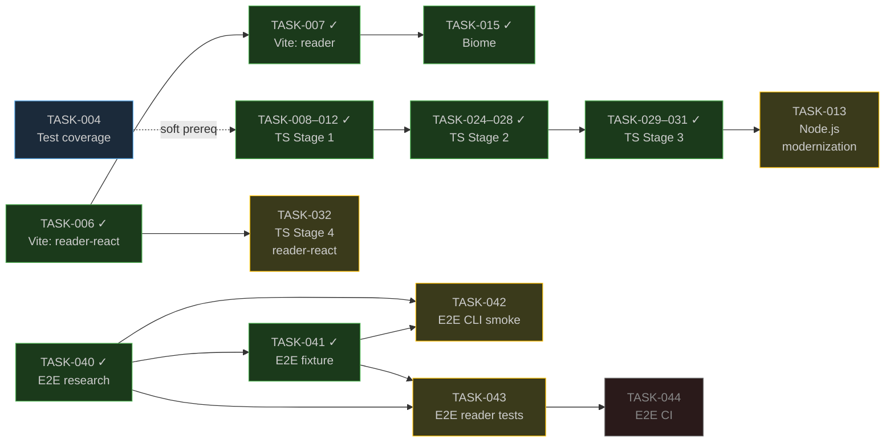

# b-ber monorepo — Project Plan

_Last updated: 2026-06-04 (TASK-059 complete; targets es2020→es2022, engines >= 22.x)_

---

## Goal

Modernize the b-ber monorepo in three parallel streams before releasing a new
stable version:

1. **Test coverage** (TASK-004) — raise coverage to ≥ 75% monorepo-wide before
   any large refactor
2. **Bundler + toolchain** (TASK-006/007/015) — replace webpack with Vite and
   ESLint + Prettier with Biome ✓ complete
3. **TypeScript migration** (TASK-008–031) — convert all Node packages to
   TypeScript ✓ Stages 1–3 complete; Stage 4 (reader-react) pending

A fourth stream (Node.js modernization, TASK-013) follows the TypeScript
migration and is now unblocked. Biome (TASK-015) shipped with the Vite
migration.

---

## Branch Strategy

| Branch                      | Role                                                                | Merges into     |
| --------------------------- | ------------------------------------------------------------------- | --------------- |
| `main`                      | stable, production-ready                                            | —               |
| `feat/upgrades`             | integration branch — planning, docs, and completed feature branches | `main`          |
| `feat/vite-migration`       | TASK-006, TASK-007, TASK-015 — **merged** ✓                        | `feat/upgrades` |
| `feat/ts-stage-1`           | TASK-008 through TASK-012 — **merged** ✓                           | `feat/upgrades` |
| `feat/ts-stage-2`           | TASK-024 through TASK-028 — **merged** ✓                           | `feat/upgrades` |
| `feat/ts-stage-3`           | TASK-029 through TASK-031 — **merged** ✓                           | `feat/upgrades` |
| `feat/node-modernization-*` | TASK-013 per-package slices — not yet started                       | `feat/upgrades` |
| `feat/ts-stage-4`           | TASK-032 (reader-react TS) — not yet started                       | `feat/upgrades` |

**All implementation work happens on feature branches.** Feature branches merge
into `feat/upgrades` once stable and tested. `feat/upgrades` merges to `main`
when a coherent set of work is complete and `npm test` passes cleanly from the
repo root.

Agents should never commit implementation work directly to `main`.

### Current branch state

`feat/upgrades` is the active integration branch. All four implementation
feature branches (`feat/vite-migration`, `feat/ts-stage-1`, `feat/ts-stage-2`,
`feat/ts-stage-3`) have been merged into it. The branch contains all planning
docs, completed migration work, and toolchain upgrades and is pending a merge
to `main` once the test suite and coverage targets are clean.

---

## Task Status

### Completed

| Task     | Title                                                    | Branch                |
| -------- | -------------------------------------------------------- | --------------------- |
| TASK-001 | Research webpack replacement (chose Vite)                | `feat/upgrades`       |
| TASK-002 | Plan JS→TS migration strategy                            | `feat/upgrades`       |
| TASK-003 | Research type consolidation                              | `feat/upgrades`       |
| TASK-005 | Research Biome migration (chose Option B)                | `feat/upgrades`       |
| TASK-006 | Migrate b-ber-reader-react webpack → Vite                | `feat/vite-migration` |
| TASK-007 | Migrate b-ber-reader to Vite; remove webpack             | `feat/vite-migration` |
| TASK-008 | Set up shared TypeScript infrastructure                  | `feat/ts-stage-1`     |
| TASK-009 | Convert b-ber-shapes-directives to TS                    | `feat/ts-stage-1`     |
| TASK-010 | Convert b-ber-shapes-dublin-core + sequences to TS       | `feat/ts-stage-1`     |
| TASK-011 | Convert b-ber-logger to TS                               | `feat/ts-stage-1`     |
| TASK-012 | Convert b-ber-lib to TS                                  | `feat/ts-stage-1`     |
| TASK-015 | Migrate from ESLint + Prettier to Biome                  | `feat/vite-migration` |
| TASK-016 | Circular import audit + arch risk catalog                | `feat/upgrades`       |
| TASK-024 | TypeScript Stage 2 parent                                | `feat/ts-stage-2`     |
| TASK-025 | Convert b-ber-grammar-\* to TypeScript                   | `feat/ts-stage-2`     |
| TASK-026 | Convert b-ber-parser-\* to TypeScript                    | `feat/ts-stage-2`     |
| TASK-027 | Convert b-ber-templates to TypeScript                    | `feat/ts-stage-2`     |
| TASK-028 | Convert b-ber-markdown-renderer to TypeScript            | `feat/ts-stage-2`     |
| TASK-029 | TypeScript Stage 3 parent                                | `feat/ts-stage-3`     |
| TASK-030 | Convert b-ber-tasks to TypeScript                        | `feat/ts-stage-3`     |
| TASK-031 | Convert b-ber-cli to TypeScript                          | `feat/ts-stage-3`     |
| TASK-033 | Evaluate code coverage tooling                           | `feat/upgrades`       |
| TASK-034 | Upgrade Jest from v26 to v29                             | `feat/upgrades`       |
| TASK-036 | Upgrade Lerna and migrate off bootstrap                  | `feat/upgrades`       |
| TASK-014 | GitHub issue tracking setup                              | `feat/upgrades`       |
| TASK-048 | Convert b-ber-resources to TypeScript                    | `feat/upgrades`       |
| TASK-040 | E2E testing — research: tooling, fixture design, package boundary | `feat/upgrades` |
| TASK-054 | Research build dep ordering: reader → reader-react               | `feat/upgrades` |
| TASK-057 | Simplify root build script: drop shim, use Lerna topo sort       | `feat/e2e`      |
| TASK-058 | Audit Node.js polyfills in reader-react browser bundle            | `feat/e2e`      |
| TASK-059 | Bump build targets: Node packages + browser bundles               | `feat/e2e`      |

### In progress

| Task     | Title                       | Branch          | Notes                                                                      |
| -------- | --------------------------- | --------------- | -------------------------------------------------------------------------- |
| TASK-004 | Monorepo-wide test coverage | `feat/upgrades` | Ongoing per-package work; final baseline needed before closing |
| TASK-019 | TypeScript migration parent | `feat/upgrades` | Stages 1–3 ✓; Stage 4 (reader-react, TASK-032) is now unblocked |

### Not started — can begin now

| Task     | Title                                              | Priority | Branch                 | Notes                                                                             |
| -------- | -------------------------------------------------- | -------- | ---------------------- | --------------------------------------------------------------------------------- |
| TASK-039 | E2E testing umbrella (parent)                      | high     | `feat/upgrades`        | CLI smoke + reader browser tests; `b-ber-testing` package confirmed              |
| TASK-041 | ~~E2E testing — kitchen-sink fixture project~~     | ~~high~~ | `feat/e2e`             | **Complete.** epub + reader build clean; EPUBCheck passes.                        |
| TASK-042 | E2E testing — CLI smoke tests                      | high     | `feat/e2e`             | Playwright test runner; epub + reader targets (web lower priority)               |
| TASK-043 | E2E testing — reader browser tests (Playwright)    | high     | `feat/e2e`             | Navigation + directive rendering; depends on TASK-041 fixture                    |
| TASK-050 | CLI command inventory + handler test coverage      | high     | `feat/upgrades`        | Safety gate for logger refactor (TASK-046); mocks `b-ber-tasks` in handler tests |
| TASK-013 | Node.js modernization                              | medium   | `feat/node-modern-*`   | Blocker TASK-012 ✓; per-package audits; target Node ≥ 22.x                       |
| TASK-032 | Convert b-ber-reader-react to TypeScript (Stage 4) | medium   | `feat/ts-stage-4`      | Blocker TASK-006 ✓; largest and most complex package; low urgency                |
| TASK-035 | Fix and modernize CircleCI pipeline                | medium   | `feat/upgrades`        | Stale Docker image; bootstrap step already removed; unblocked by TASK-036        |
| TASK-046 | Refactor b-ber-logger                              | medium   | `feat/logger-refactor` | Remove `process.exit` from `log.error`; depends on TASK-050 handler tests first  |
| TASK-051 | Theme customization docs + SCSS test coverage      | medium   | `feat/upgrades`        | No SCSS compilation tests exist; also documents the sass pipeline architecture   |
| TASK-053 | Replace lerna-update-wizard with syncpack + ncu    | medium   | `feat/upgrades`        | `lernaupdate` breaks on Lerna v7+; `syncpack` + `ncu --workspaces`               |
| TASK-037 | Replace or reconfigure dependency management       | low      | `feat/upgrades`        | Dependabot paused + broken; recommend Option A: remove + npm audit in CI         |
| TASK-038 | Audit and clean up package.json scripts            | low      | `feat/upgrades`        | Inconsistent naming, dead scripts; some cleanup is downstream of migrations      |
| TASK-045 | Refactor changelog generation + release workflow   | low      | `feat/upgrades`        | Manual, fragile sequencing; evaluate changesets / release-please                 |
| TASK-047 | Research watch mode scripts for dev workflow       | low      | `feat/upgrades`        | Most packages lack a `watch` script; define target state per package type        |
| TASK-049 | Evaluate coverage report upload services           | low      | `feat/upgrades`        | No service active; assess Codecov, Coveralls, GitHub Actions summary             |
| TASK-052 | Research Verdaccio workflow for lerna publish      | low      | `feat/upgrades`        | No `--dry-run` in lerna publish; Verdaccio = local registry stand-in             |
| TASK-017 | Expand diagrams: tooling versions + cross-refs     | low      | `feat/upgrades`        | Living audit surface; TASK-016 complete                                           |
| TASK-018 | Add task file links to GitHub issues               | low      | `feat/upgrades`        | Blocked on `feat/upgrades` merge to `main`; links 404 until then                 |
| TASK-021 | Audit `--no-package-lock` in lerna bootstrap       | low      | `feat/upgrades`        | Review alongside `--legacy-peer-deps`                                             |
| TASK-022 | Automate circular dependency checks                | low      | `feat/upgrades`        | Options: pre-commit hook, CI, or `npm test`                                       |
| TASK-023 | Research Lerna replacement / upgrade options       | —        | `feat/upgrades`        | Superseded by TASK-036; retain for research notes only                            |

### Not started — blocked

| Task     | Title                                              | Waiting on          |
| -------- | -------------------------------------------------- | ------------------- |
| TASK-044 | E2E testing — CI integration                       | TASK-043            |
| TASK-055 | Create testing skill                               | ~~TASK-041~~ ✓ — unblocked |

---

## Dependency Graph

Notes:

- TASK-004 is a soft prerequisite for the TS migration: do not start TASK-008+
  until overall coverage is ≥ 60% (already satisfied; migration is now done).
- TASK-006 and the TS stage work are fully independent and ran in parallel.
- TASK-025, TASK-026, TASK-027 are independent of each other within Stage 2.
- TASK-028 depends on TASK-025 + TASK-026 (imports all grammar/parser packages).
- TASK-015 (Biome) shipped on the same branch as TASK-006/007.
- TASK-032 is unblocked now that TASK-006 (Vite) is complete.
- TASK-013 is unblocked now that all TS stages (1–3) are complete.

---

## Per-Package Test Coverage (TASK-004 sub-tasks)

These are tracked as `TASK-001.open.md` within each package's `tasks/` directory.

| Package                    | Starting coverage | Current | Target | Status      |
| -------------------------- | ----------------- | ------- | ------ | ----------- |
| b-ber-lib                  | 17%               | 71%     | ≥ 75%  | in progress |
| b-ber-tasks                | ~0%               | ~15%    | ~25%\* | in progress |
| b-ber-logger               | 0%                | 73%     | ≥ 75%  | in progress |
| b-ber-markdown-renderer    | 0%                | 83%     | ≥ 75%  | complete    |
| b-ber-cli                  | 24%               | 65%     | ≥ 75%  | in progress |
| b-ber-templates            | mixed             | 96%     | ≥ 75%  | complete    |
| b-ber-validator            | 69%               | 69%     | ≥ 80%  | not started |
| b-ber-grammar-\* (14 pkgs) | 0%                | ~80%    | ≥ 75%  | in progress |
| b-ber-parser-\* (5 pkgs)   | 0%                | ~90%    | ≥ 75%  | in progress |
| b-ber-reader-react         | mixed             | mixed   | ≥ 75%  | not started |

Priority order: ~~b-ber-logger~~ ✓ → ~~b-ber-templates~~ ✓ → ~~grammar/parser stubs~~ ✓ → b-ber-lib → b-ber-cli → reader-react.

_Note: minimum coverage target raised from 60% to 75% on 2026-06-02. Packages previously
marked complete at ≥ 60% (b-ber-lib at 71%, b-ber-logger at 73%, b-ber-cli at 65%)
are reopened; they need additional tests to reach 75%._

\*b-ber-tasks: most pipeline steps (web, reader, pdf, sass, epub, etc.) require a full project
directory + external tools (Calibre, wkhtmltopdf). Realistic ceiling for pure unit tests is ~25%.
This is documented in `packages/b-ber-tasks/tasks/TASK-001.open.md`.

---

## What To Do Next

| Priority | Task     | Action                                                                                                                               |
| -------- | -------- | ------------------------------------------------------------------------------------------------------------------------------------ |
| 1        | TASK-042 | Write Playwright CLI smoke tests (epub + reader targets). Branch: `feat/e2e`. Now unblocked by TASK-041.                             |
| 2        | TASK-050 | Write CLI handler tests for `build`, `deploy`, `check`. Gate for the logger refactor — need `process.exit` assertions in place first. |
| 3        | TASK-035 | Fix CircleCI: update stale Docker image, add test step, configure to run on non-main branches. Bootstrap blocker resolved by TASK-036. |
| 4        | TASK-013 | Open per-package Node.js modernization tasks. Priority order: b-ber-tasks → b-ber-lib → b-ber-cli → grammar/parser batch.            |
| 5        | TASK-004 | Continue per-package coverage work: b-ber-lib (71% → 75%), b-ber-logger (73% → 75%), b-ber-cli (65% → 75%), b-ber-validator (69% → 80%). |
| 6        | TASK-054 | Research build dep ordering. Low effort; shapes the root `build` script and potentially the CI config.                               |
| 7        | TASK-046 | Refactor b-ber-logger once TASK-050 handler tests are in place. Remove `process.exit` from `log.error`.                             |
| 8        | TASK-032 | Plan TS Stage 4 (reader-react). Now unblocked; lowest urgency of the unblocked items given complexity.                               |

---

## Merge Checklist (before merging `feat/upgrades` → `main`)

- [ ] `npm test` passes from repo root (all ~84 suites)
- [ ] No `.open.md` tasks at high priority left untouched
- [ ] `PLAN.md` is current
- [ ] Any new feature branches have been either merged or noted as in-progress
- [ ] TASK-018 complete (task file links added to all GitHub issues)
