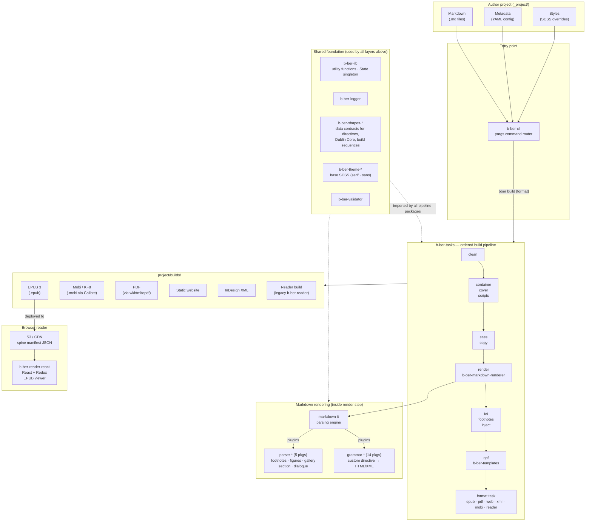

# Architecture Overview

High-level data flow from author source files to output formats and the
browser reader.

## See also

- [Package dependency graph](02-package-dependencies.md) — full internal dep map
- [Build pipeline](03-build-pipeline.md) — step ordering and State flow
- [Markdown rendering layer](04-markdown-rendering-layer.md) — grammar/parser detail
- [Reader React](05-reader-react.md) — browser reader component tree
- [Tooling matrix](06-tooling-matrix.md) — versions and build tooling per package
- [External dependencies](07-external-dependencies.md) — version audit and staleness flags
- [Diagram index](README.md)
