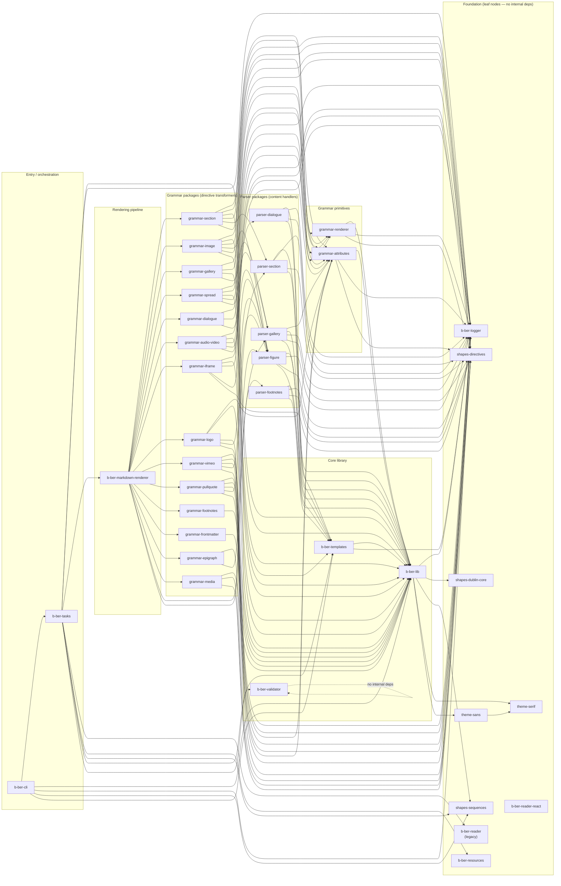

# Package Dependency Graph

All internal (`@canopycanopycanopy/*`) dependencies. Arrows point from
dependent to dependency. Packages with no internal deps are leaf nodes.

External dependencies (lodash, markdown-it, fs-extra, etc.) are omitted.

## Dependency layers (bottom-up)

| Layer                  | Packages                                                                                                                             |
| ---------------------- | ------------------------------------------------------------------------------------------------------------------------------------ |
| 0 — leaf               | logger, shapes-directives, shapes-dublin-core, shapes-sequences, theme-serif, theme-sans, resources, reader, reader-react, validator |
| 1 — core lib           | b-ber-lib (→ logger, shapes, themes), b-ber-templates (→ lib, logger)                                                                |
| 2 — grammar primitives | grammar-renderer, grammar-attributes (→ lib, logger, shapes-directives)                                                              |
| 3 — parsers            | parser-\* (→ lib, logger, shapes-directives, templates)                                                                              |
| 4 — grammars           | grammar-_ (→ grammar-renderer, grammar-attributes, parser-_, lib, logger, shapes-directives)                                         |
| 5 — rendering          | b-ber-markdown-renderer (→ all grammar-\*, parser-footnotes, parser-gallery)                                                         |
| 6 — pipeline           | b-ber-tasks (→ markdown-renderer, lib, logger, templates, validator, resources, reader, shapes-sequences)                            |
| 7 — entry              | b-ber-cli (→ tasks, lib, logger, templates, shapes-sequences)                                                                        |
