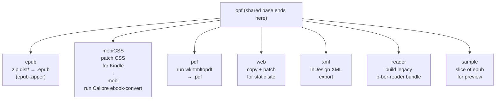
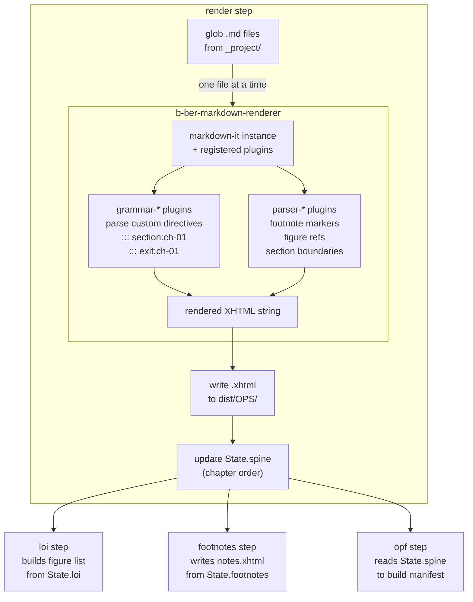

# Build Pipeline

The ordered task sequence executed for each output format. Steps are run
sequentially; each step receives the shared `State` singleton updated by
prior steps.

## Shared base sequence (all formats)

```mermaid
flowchart LR
    CLEAN["clean\nclear dist/"] --> CONTAINER
    CONTAINER["container\ncreate EPUB dir\nstructure"] --> COVER
    COVER["cover\ngenerate cover\nimage"] --> SASS
    SASS["sass\ncompile SCSS\n→ CSS"] --> COPY
    COPY["copy\nassets + fonts\nto dist/"] --> SCRIPTS
    SCRIPTS["scripts\ncopy JS\nto dist/"] --> RENDER
    RENDER["render\nMarkdown → XHTML\n(markdown-renderer)"] --> LOI
    LOI["loi\nlist of\nillustrations"] --> FOOTNOTES
    FOOTNOTES["footnotes\ncollect + write\nnotes.xhtml"] --> INJECT
    INJECT["inject\npatch xhtml\n(nav, ncx refs)"] --> OPF
    OPF["opf\nwrite OPF manifest\n+ NCX spine\n(b-ber-templates)"] --> FMT
    FMT["format\ntask ↓"]
```

## Format-specific tail tasks

## State flow through the render step

## External tool dependencies

| Step | External dependency          | Required for    |
| ---- | ---------------------------- | --------------- |
| mobi | Calibre `ebook-convert`      | Mobi/KF8 output |
| pdf  | `wkhtmltopdf`                | PDF output      |
| sass | (none — uses `sass` npm pkg) | —               |
| epub | `epub-zipper` npm pkg        | EPUB packaging  |
