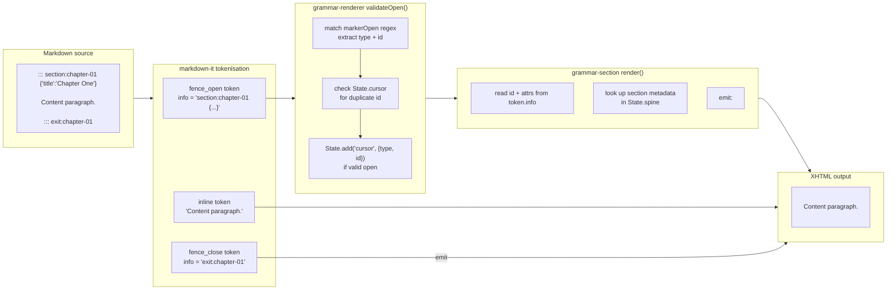

# Markdown Rendering Layer

How `b-ber-markdown-renderer` composes grammar and parser packages to
transform extended Markdown into EPUB-compatible XHTML.

## Package composition

```mermaid
graph TD
    subgraph MDR["b-ber-markdown-renderer"]
        MDIT["markdown-it\nparsing engine"]

        subgraph BLOCK["Block-level grammar plugins"]
            gr-sec["grammar-section\n::: section:id / ::: exit:id"]
            gr-img["grammar-image\n::: image:id"]
            gr-gal["grammar-gallery\n::: gallery:id"]
            gr-spr["grammar-spread\n::: spread:id"]
            gr-dial["grammar-dialogue\n::: dialogue:id"]
            gr-av["grammar-audio-video\n::: audio:id / video:id"]
            gr-iframe["grammar-iframe\n::: iframe:id"]
            gr-logo["grammar-logo\n::: logo:id"]
            gr-vim["grammar-vimeo\n::: vimeo:id"]
            gr-pq["grammar-pullquote\n::: pullquote:id"]
            gr-epig["grammar-epigraph\n::: epigraph:id"]
            gr-media["grammar-media\n::: media:id"]
        end

        subgraph INLINE["Inline grammar plugins"]
            gr-fn["grammar-footnotes\n[^ref]"]
            gr-fm["grammar-frontmatter\nYAML front matter"]
        end

        subgraph PARSER_PLUGINS["Parser plugins (markdown-it rules)"]
            p-fn["parser-footnotes\nfootnote_def · footnote_ref\nfootnote_inline"]
            p-gal["parser-gallery\ngallery figure parsing"]
        end

        MDIT --> BLOCK
        MDIT --> INLINE
        MDIT --> PARSER_PLUGINS
    end

    subgraph PRIM["Grammar primitives"]
        gr-rend["grammar-renderer\ncreateRenderer factory\nvalidates open/close pairs\ntracks cursor in State"]
        gr-attr["grammar-attributes\nparses attribute blocks\n{ .class #id key=val }"]
    end

    subgraph PARSERS_STANDALONE["Standalone parsers (called by grammar packages)"]
        p-sec["parser-section\nsection boundary markers"]
        p-fig["parser-figure\nfigure / caption structures"]
        p-dial["parser-dialogue\ndialogue markup"]
    end

    subgraph FOUNDATION["Shared foundation"]
        lib["b-ber-lib · State"]
        log["b-ber-logger"]
        shapes-dir["shapes-directives"]
        tpl["b-ber-templates"]
    end

    %% Grammar packages depend on primitives
    gr-sec & gr-gal & gr-spr & gr-dial --> gr-rend
    gr-sec & gr-img & gr-gal & gr-spr & gr-dial & gr-av & gr-iframe & gr-logo & gr-vim & gr-pq --> gr-attr

    %% Grammar packages depend on parsers
    gr-sec & gr-pq --> p-sec
    gr-img & gr-av & gr-iframe & gr-logo & gr-vim --> p-fig
    gr-epig --> p-fig
    gr-gal & gr-spr --> p-gal
    gr-dial --> p-dial

    %% Parser plugins depend on parsers
    p-gal --> gr-attr

    %% All depend on foundation
    gr-rend & gr-attr --> lib & log & shapes-dir
    p-sec & p-fig & p-dial --> lib & log & shapes-dir & tpl
    p-fn & p-gal --> lib & log & shapes-dir & tpl
    gr-fn & gr-fm --> lib
    gr-media --> lib & log & shapes-dir
    gr-epig --> log
```

## Directive syntax → HTML transformation

Custom directives use a fenced-block syntax (three or more colons). The
`grammar-renderer` factory enforces that every open directive has a matching
close and that IDs are unique within a document.

## State mutations during rendering

`b-ber-lib/State` is a shared mutable singleton. Grammar and parser plugins
read from and write to it during rendering:

| Plugin            | Reads                            | Writes                           |
| ----------------- | -------------------------------- | -------------------------------- |
| grammar-section   | `State.spine` (chapter metadata) | `State.cursor` (open directives) |
| grammar-image     | `State.loi` (figure list)        | `State.loi`                      |
| grammar-footnotes | —                                | `State.footnotes`                |
| parser-footnotes  | `State.config.group_footnotes`   | `State.footnotes`                |
| grammar-renderer  | `State.cursor`                   | `State.cursor` (add/remove)      |
| All grammar-\*    | `State.build` (epub/web/pdf)     | —                                |
