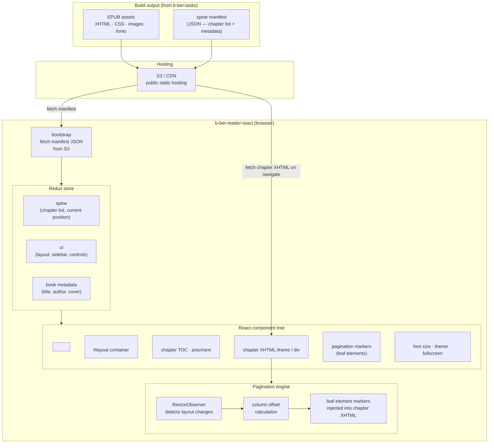
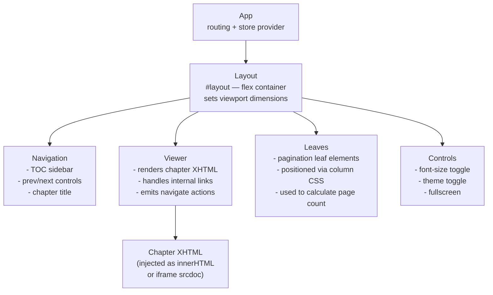
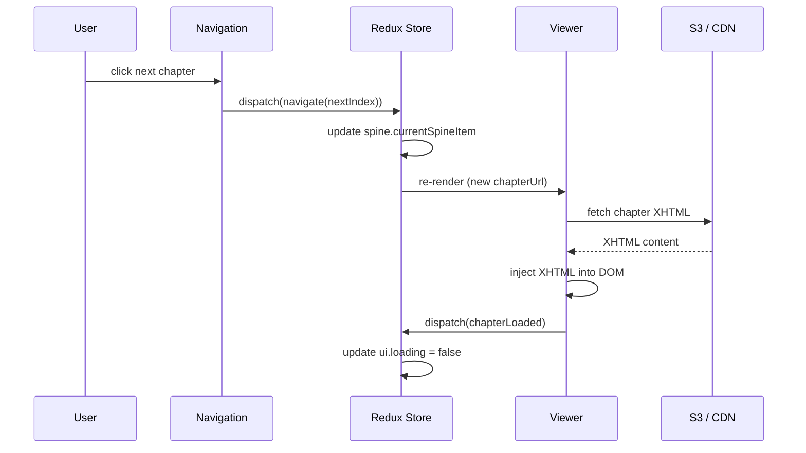

# b-ber-reader-react Architecture

The browser-based EPUB viewer. Reads a spine manifest from S3/CDN and
renders chapter XHTML files as a paginated single-page application.

## Data flow

## Component hierarchy

## Redux action flow (navigation)

## Build tooling

| Concern    | Current                       | Planned (TASK-006)            |
| ---------- | ----------------------------- | ----------------------------- |
| Bundler    | webpack 5                     | Vite                          |
| Transpiler | Babel + `@babel/preset-react` | Vite (esbuild under the hood) |
| Dev server | webpack-dev-server            | Vite dev server (HMR)         |
| CSS        | SCSS via sass-loader          | SCSS via vite-plugin-sass     |
| Linting    | ESLint + Prettier             | Biome (TASK-015)              |
