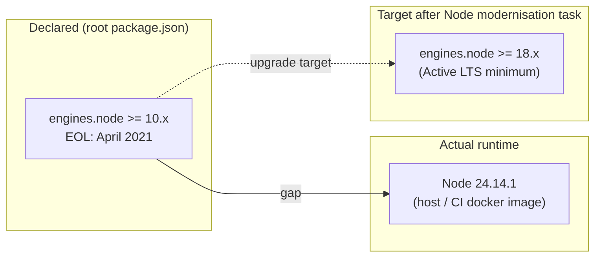
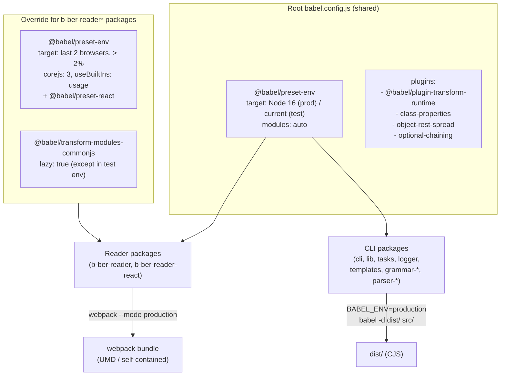

# Tooling Matrix

Per-package audit of Node.js target, transpiler, test runner, module format,
and build tooling. Use this to spot packages that are out of date or out of
sync with the expected post-TASK-008 state.

**Last updated:** 2026-06-19 (hand-maintained; see TASK-017 for automation plan)

## Legend

| Symbol | Meaning |
| ------ | ------- |
| OK | At or near current stable |
| STALE | Behind current stable; needs upgrade |
| DEPRECATED | Package or API is deprecated |
| BLOCKER | Blocks a planned migration (see linked task) |

## Node.js engine targets

All packages inherit `engines.node >= 10.x` from the root `package.json`.
No package overrides this. Node 10 reached EOL in April 2021; current LTS
is Node 22 and the runtime on this repo's host is Node 24.



## Package tooling table

Columns:

- **Node target** — `engines.node` from `package.json` (root applies to all)
- **Transpiler** — how source is compiled
- **Test transform** — Jest transform used for `.js` / `.ts` files
- **Output** — `dist/` emitted by a build step vs source shipped as-is
- **Bundler** — webpack, none, etc.
- **TS** — TypeScript in use for this package

| Package | Node target | Transpiler | Test transform | Output | Bundler | TS |
| ------- | ----------- | ---------- | -------------- | ------ | ------- | -- |
| **b-ber-cli** | >= 10 STALE | Babel 7 (`@babel/preset-env` → Node 16 prod) | `babel-jest ^24` STALE | `dist/` | none | no |
| **b-ber-lib** | >= 10 STALE | Babel 7 (`@babel/preset-env` → Node 16 prod) | `babel-jest ^24` STALE | source (`index.js`) | none | no |
| **b-ber-tasks** | >= 10 STALE | Babel 7 (`@babel/preset-env` → Node 16 prod) | `babel-jest ^24` STALE | `dist/` | none | no |
| **b-ber-markdown-renderer** | >= 10 STALE | Babel 7 (`@babel/preset-env` → Node 16 prod) | `babel-jest ^24` STALE | `dist/` | none | no |
| **b-ber-logger** | >= 10 STALE | Babel 7 (`@babel/preset-env` → Node 16 prod) | `babel-jest ^24` STALE | `dist/` | none | no |
| **b-ber-validator** | >= 10 STALE | TypeScript (`tsc`) | `ts-jest ^26` STALE | `dist/` | none | yes (^4.0.5) STALE |
| **b-ber-templates** | >= 10 STALE | Babel 7 (`@babel/preset-env` → Node 16 prod) | `babel-jest ^24` STALE | source (`index.js`) | none | no |
| **b-ber-resources** | >= 10 STALE | Babel 7 (prepare script) | `babel-jest ^24` STALE | source (`index.js`) | none | no |
| **b-ber-reader** | >= 10 STALE | Babel 7 + `@babel/preset-env` (browser targets) | `babel-jest ^24` STALE | webpack bundle | webpack ^5.74.0 | no |
| **b-ber-reader-react** | >= 10 STALE | Babel 7 + `@babel/preset-react` + `@babel/preset-env` | `babel-jest ^24` STALE | webpack bundle | webpack ^5.74.0 | no |
| **grammar-\*** (14 pkgs) | >= 10 STALE | Babel 7 (`@babel/preset-env` → Node 16 prod) | `babel-jest ^24` STALE | `dist/` | none | no |
| **parser-\*** (5 pkgs) | >= 10 STALE | Babel 7 (`@babel/preset-env` → Node 16 prod) | `babel-jest ^24` STALE | `dist/` | none | no |
| **shapes-\*** (3 pkgs) | >= 10 STALE | Babel 7 (prepare script) | `babel-jest ^24` STALE | source (`index.js`) | none | no |
| **theme-serif / theme-sans** | >= 10 STALE | none (SCSS source only) | `babel-jest ^24` STALE | source (`index.js`) | none | no |

## Key version facts (root `package.json`)

| Dependency | Pinned version | Current stable | Status |
| ---------- | -------------- | -------------- | ------ |
| `jest` | `^26.6.3` | 29.x | STALE BLOCKER |
| `babel-jest` | `^24.8.0` | 29.x | STALE BLOCKER |
| `ts-jest` | `^26.4.4` | 29.x | STALE |
| `@babel/core` | `^7.10.5` | 7.x (minor only) | OK |
| `@babel/preset-env` | `^7.10.4` | 7.x (minor only) | OK |
| `typescript` | `^4.0.5` | 5.x | STALE — TypeScript 5 required for TASK-008 |
| `webpack` | `^5.74.0` | 5.x | OK (but targeted for removal in TASK-006) |
| `lerna` | `^6.5.1` | 8.x | STALE |
| `react` | `^19` | 19.x | OK |
| `redux` | `^5.0.0` | 5.x | OK |
| `react-redux` | `^9.2.0` | 9.x | OK |

## Jest configuration issues

The root `jest.config.js` uses:

```js
testURL: 'http://localhost/'
```

`testURL` was **removed in Jest 27** (replaced by `testEnvironmentOptions.url`).
Its presence confirms Jest is pinned to v26 — upgrading to v27+ without removing
this key will cause test startup failures.

```js
testEnvironment: 'jest-environment-jsdom-global'
```

`jest-environment-jsdom-global` is a community package that extends the built-in
`jsdom` environment. It was pinned at `^1.1.0` and is not maintained for Jest 27+.
Migration target: use `@jest/environment-jsdom` with `testEnvironmentOptions`.

## Transpiler architecture



## Post-TASK-008 expected state

After TASK-008 (TypeScript migration) completes, the expected state is:

| Concern | Current | Target |
| ------- | ------- | ------ |
| Source language | JavaScript (.js) | TypeScript (.ts) |
| Transpiler | Babel 7 | tsdown (tsc-based) |
| Test transform | `babel-jest ^24` | `@swc/jest` or `ts-jest ^29` |
| Jest version | `^26.6.3` | `^29.x` |
| Module format | CJS via Babel | CJS via tsc/tsdown |
| Node target | >= 10 (declared) | >= 18 (realistic minimum) |

Grammar and parser packages are the primary migration candidates: they are all
source-identical in structure (one `src/index.js`, one test file) and can be
converted in parallel batches.

## See also

- [Architecture overview](01-architecture-overview.md) — data flow from source to output
- [Package dependency graph](02-package-dependencies.md) — full internal dep map
- [Build pipeline](03-build-pipeline.md) — step ordering and State flow
- [Markdown rendering layer](04-markdown-rendering-layer.md) — grammar/parser detail
- [Reader React](05-reader-react.md) — browser reader component tree
- [External dependencies](07-external-dependencies.md) — version audit and staleness flags
- [Diagram index](README.md)
