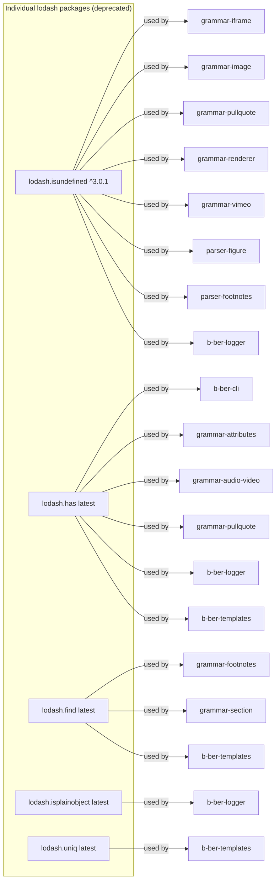

# External Dependencies

Version audit for key external dependencies across the monorepo.
Groups by concern and flags staleness, deprecation, and consolidation targets.

**Last updated:** 2026-06-19 (hand-maintained; see TASK-017 for automation plan)

## Status legend

| Symbol | Meaning |
| ------ | ------- |
| OK | At or near current stable; no action needed |
| STALE | Behind current stable; upgrade is a good idea |
| STALE-BLOCKER | Staleness is actively blocking a migration task |
| DEPRECATED | Package is unmaintained or removed from npm |
| CONFLICT | Multiple major versions in the same dep tree |
| CONSOLIDATE | Duplicate copies across packages; should be hoisted to root |

## Test tooling

| Package | Version in use | Current stable | Status | Notes |
| ------- | -------------- | -------------- | ------ | ----- |
| `jest` | `^26.6.3` | 29.x | STALE-BLOCKER | Used in all 34 packages. `testURL` in `jest.config.js` is a removed Jest 27 option — blocks upgrade without config change. Blocks TASK-008. |
| `babel-jest` | `^24.8.0` (root) | 29.x | STALE-BLOCKER | Major version gap: v24 is 5 major versions behind. Tightly coupled to `jest ^26`. |
| `ts-jest` | `^26.4.4` | 29.x | STALE | Used only for `b-ber-validator`; lags Jest by 3 majors. |
| `jest-environment-jsdom` | `^23.1.0` | 29.x | STALE-BLOCKER | v23 is incompatible with Jest 27+. |
| `jest-environment-jsdom-global` | `^1.1.0` | abandoned | DEPRECATED | Unmaintained; last release in 2018. Replace with `@jest/environment-jsdom` + `testEnvironmentOptions`. |
| `jest-extended` | `^0.11.5` | 4.x | STALE | Old major; API changes in 1.x+. |
| `mock-fs` | `^4.4.2` | 4.x | STALE | v4 is incompatible with Node 24 (uses internal `binding.FSReqCallback` API removed in Node 22+). Replace with real temp dirs. See MEMORY: mock-fs Node 24 incompatibility. |
| `istanbul` | `^0.4.5` | retired | DEPRECATED | Istanbul v1 was retired in 2017; v2 ships as `nyc`. Jest 26+ uses its own built-in V8 coverage. Remove. |
| `istanbul-api` | `1.2.2` | retired | DEPRECATED | Same as above. |
| `istanbul-reports` | `1.1.4` | retired | DEPRECATED | Same as above. |
| `coveralls` | `^3.0.1` | (service sunset) | DEPRECATED | Coveralls discontinued its free OSS plan; package is stale. Remove or replace with Codecov. |

## Build tooling

| Package | Version in use | Current stable | Status | Notes |
| ------- | -------------- | -------------- | ------ | ----- |
| `webpack` | `^5.74.0` | 5.x | OK | Used by `b-ber-reader` and `b-ber-reader-react`. Targeted for removal and replacement with Vite in TASK-006. |
| `webpack-cli` | `^4.10.0` | 5.x | STALE | Minor mismatch with webpack 5.x; webpack-cli 5 aligns with webpack 5.x |
| `webpack-dev-server` | `^4.11.1` | 5.x | STALE | — |
| `webpack-bundle-analyzer` | `^4.6.1` | 4.x | OK | — |
| `webpack-cleanup-plugin` | `^0.5.1` | archived | DEPRECATED | Plugin is unmaintained; webpack 5 removes the need for manual dist cleanup. |
| `webpack-node-externals` | `^1.6.0` | 3.x | STALE | Two major versions behind. |
| `webpack-fix-style-only-entries` | `^0.6.1` | deprecated | DEPRECATED | Superseded by `webpack-remove-empty-scripts`. Both are in use. |
| `webpack-remove-empty-scripts` | `^1.0.1` | 1.x | OK | Replacement for `webpack-fix-style-only-entries`. |
| `babel-loader` | `^8.2.3` | 9.x | STALE | Major version behind. |
| `html-webpack-plugin` | `^4.5.2` | 5.x | STALE | — |
| `sass-loader` | `^13.0.2` | 16.x | STALE | — |
| `css-loader` | `^0.28.10` | 7.x | STALE | v0.28 is ancient; 7 major versions behind. |
| `style-loader` | `^0.20.2` | 4.x | STALE | Very old; 4 major versions behind. |
| `postcss-loader` | `^2.1.1` | 8.x | STALE | 6 major versions behind. |
| `postcss` | `^7.0.14` | 8.x | STALE | PostCSS 8 is a breaking change (plugins must update). |
| `postcss-cssnext` | `^3.1.0` | abandoned | DEPRECATED | The `postcss-cssnext` package was deprecated in 2018 in favour of individual `postcss-preset-env` plugins. |
| `postcss-import` | `^11.1.0` | 16.x | STALE | — |
| `mini-css-extract-plugin` | `^1.6.2` | 2.x | STALE | — |
| `file-loader` | `^6.2.0` | deprecated | DEPRECATED | Webpack 5 has built-in asset modules; `file-loader` is no longer needed. |
| `url-loader` | `^4.1.1` | deprecated | DEPRECATED | Same as `file-loader` — replaced by webpack 5 asset modules. |
| `lerna` | `^6.5.1` | 8.x | STALE | 2 major versions behind. |
| `rimraf` | `^2.7.1` | 6.x | STALE | v2 was a Node-callback-based fs.remove wrapper; modern Node has `fs.rm`. |
| `svgo` | `^1.3.0` | 3.x | STALE | v1 API is completely different from v3 (config format changed). |

## TypeScript

| Package | Version in use | Current stable | Status | Notes |
| ------- | -------------- | -------------- | ------ | ----- |
| `typescript` | `^4.0.5` | 5.x | STALE-BLOCKER | TypeScript 5 is required for `satisfies`, const type parameters, decorator metadata. Blocks TASK-008. Only `b-ber-validator` currently uses TypeScript; all other packages use Babel. |
| `@typescript-eslint/eslint-plugin` | `^4.8.1` | 8.x | STALE | ESLint is being replaced by Biome (TASK-015). |
| `@typescript-eslint/parser` | `^4.8.1` | 8.x | STALE | Same as above. |
| `@types/node` | `^14.14.7` | 22.x | STALE | Types for Node 14; current runtime is Node 24. |

## Linting and formatting

| Package | Version in use | Current stable | Status | Notes |
| ------- | -------------- | -------------- | ------ | ----- |
| `eslint` | `^7.32.0` | 9.x | STALE | Flat config required in ESLint 9. Being replaced by Biome (TASK-015). Present in root and `b-ber-reader-react`. |
| `eslint-config-airbnb` | `^19.0.4` | 19.x | OK (but see note) | Requires ESLint 7; incompatible with ESLint 9 flat config. Remove when Biome migration is complete. |
| `eslint-config-prettier` | `^6.15.0` | 9.x | STALE | Moot once Biome replaces Prettier. |
| `eslint-plugin-babel` | `^4.1.2` | 5.x | STALE | — |
| `prettier` | `^1.15.1` | 3.x | STALE | v1 is very old; being replaced by Biome (TASK-015). |
| `babel-eslint` | `^8.2.2` | retired | DEPRECATED | `babel-eslint` was deprecated in 2020 in favour of `@babel/eslint-parser`. |
| `sass-lint` | `^1.13.1` | unmaintained | DEPRECATED | Abandoned; superseded by `stylelint`. |

## Node.js stdlib replacements (candidates for removal)

These packages filled gaps in older Node.js APIs. Most can be replaced by
built-in Node.js APIs on any version >= 14.

| Package | Version in use | Status | Replacement |
| ------- | -------------- | ------ | ----------- |
| `fs-extra` | `^8.1.0` | STALE | `fs.promises` covers most of `fs-extra`'s API surface in Node >= 14. `^8` predates the promise-first default in `^10`. |
| `glob` | `^7.1.4` | STALE | `glob ^10` or Node 22's built-in `fs.glob`. |
| `js-yaml` | `^3.12.0` | STALE | `^4.x` has a breaking API change (removes `safeLoad`). Upgrade requires code change. |
| `rimraf` | `^2.7.1` | STALE | `fs.rm({ recursive: true })` in Node >= 14.14. |
| `mkdirp` | (transitive) | STALE | `fs.mkdir({ recursive: true })` in Node >= 10.12. |
| `htmlparser2` | `^3.9.2` | STALE | 9.x is current. |
| `markdown-it` | `^8.4.1` | STALE | 14.x is current; v8 is 6 major versions behind. |

## Individual lodash method packages (deprecated)

The lodash project recommends importing from the monolithic `lodash` package
rather than using per-method packages. These are all still in active use:

**Remediation:** Replace all usages with `import { isUndefined, has, find, isPlainObject, uniq } from 'lodash'`.
The monolithic `lodash ^4.17.21` is already a dev dependency at the root.

## React / UI

| Package | Version in use | Current stable | Status | Notes |
| ------- | -------------- | -------------- | ------ | ----- |
| `react` | `^19` (root) | 19.x | OK | Root declares `^19`; `b-ber-reader` pins `^19`; `b-ber-reader-react` peer-requires `>=16.2.0 <=19`. |
| `react-dom` | `^19` (root) | 19.x | OK | Same as above. |
| `react-redux` | `^9.2.0` | 9.x | OK | — |
| `redux` | `^5.0.0` | 5.x | OK | — |
| `redux-thunk` | `^3.1.0` | 3.x | OK | — |
| `prop-types` | `^15.6.1` | 15.x | OK (but note) | React 19 deprecated prop-types validation at runtime. Consider removing. |
| `react-player` | `^2.10.1` | 2.x | OK | — |
| `html-to-react` | `^1.4.3` | 1.x | STALE | — |
| `history` | `^4.7.2` | 5.x | STALE | v5 API is breaking; v4 is React Router v5 era. |
| `react-attr-converter` | `^0.3.1` | 0.3.x | OK | — |
| `classnames` | `^2.2.5` | 2.x | OK | — |
| `detect-browser` | `^2.1.0` | 5.x | STALE | — |
| `object-fit-images` | `^3.2.3` | 3.x | OK (but note) | Polyfill for CSS `object-fit`; now unnecessary on supported browsers (Edge 16+, iOS 10+). |
| `resize-observer-polyfill` | `^1.5.0` | — | DEPRECATED | ResizeObserver is now native in all supported browsers. Remove. |

## Consolidation candidates

These deps appear in multiple package `package.json` files with identical
versions, which means they are good candidates for hoisting to the root
`devDependencies` (they may already be hoisted in practice via Lerna bootstrap,
but removing the per-package declarations would clarify intent).

| Package | Copies found | Action |
| ------- | ----------- | ------ |
| `@babel/cli` | 33 packages | Hoist to root only |
| `@babel/core` | 34 packages | Hoist to root only |
| `@babel/preset-env` | 34 packages | Hoist to root only |
| `browserslist` | 32 packages | Hoist to root only |
| `rimraf` | 34 packages | Hoist to root only; replace with `fs.rm` long-term |
| `tar` | 33 packages | Audit whether all packages actually use it |
| `lodash` | 33 packages | Hoist to root only |
| `jest` | 34 packages | Hoist to root only |

## Known version conflicts

| Conflict | Description |
| -------- | ----------- |
| `babel-cli ^6.26.0` vs `@babel/cli ^7.x` | Root devDependencies has both Babel 6 (`babel-cli: ^6.26.0`) and Babel 7 (`@babel/cli: ^7.10.5`). The Babel 6 remnant is unused and should be removed. |
| `jest ^26` + `babel-jest ^24` | Mismatched major versions; both must be upgraded together to avoid transform resolution failures. |
| `postcss ^7` + `autoprefixer ^9` | Autoprefixer 10+ requires PostCSS 8. The current combination locks both to the older major. |

## See also

- [Architecture overview](01-architecture-overview.md) — data flow from source to output
- [Package dependency graph](02-package-dependencies.md) — full internal dep map
- [Build pipeline](03-build-pipeline.md) — step ordering and State flow
- [Tooling matrix](06-tooling-matrix.md) — per-package tooling audit
- [Diagram index](README.md)
