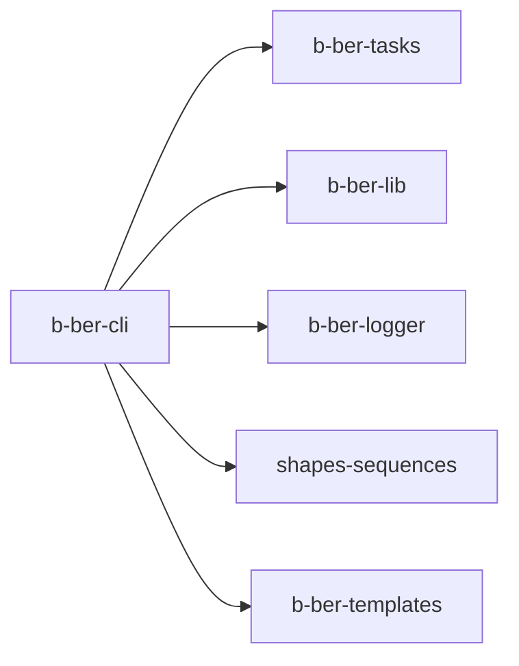

# b-ber-cli

Command-line interface and entry point for all `bber` commands. Routes yargs
commands to the appropriate task subset in `b-ber-tasks`. All build commands
(`bber epub`, `bber web`, `bber pdf`, etc.) flow through this package.

**Last updated:** 2026-06-19

## Dependency graph



See [02-package-dependencies.md](../02-package-dependencies.md) for the full
monorepo dependency map.

## Tooling

| Concern | Value |
| ------- | ----- |
| Node target | `>= 10.x` (root engine range; EOL April 2021) |
| Source language | JavaScript (`.js`) |
| Transpiler | Babel 7 — `@babel/preset-env`, target: Node 16 (prod) / current (test) |
| Build output | `dist/` via `babel -d dist/ src/` |
| Main entry | `dist/index.js` |
| Test runner | Jest `^26.6.3` |
| Test transform | `./jest-transform-upward.js` (delegates to root `babel.config.js`) |
| Bundler | none |
| TypeScript | no |

## Source structure

```
src/
  index.js      — yargs setup + command registration
  app.js        — application bootstrap
  commands/     — one file per bber sub-command
  lib/          — CLI-specific utilities (path helpers, etc.)
```

## External dependencies

| Package | Version | Status | Notes |
| ------- | ------- | ------ | ----- |
| `yargs` | `^13.3.0` | STALE | v17.x is current; v13 is 4 major versions behind. |
| `fs-extra` | `^8.1.0` | STALE | v8 predates promise-first API. |
| `lodash` | `^4.17.21` | OK | — |
| `lodash.has` | `latest` | DEPRECATED | Individual lodash method packages are deprecated. Use `import { has } from 'lodash'` instead. `latest` tag is also risky. |
| `tar` | `^6.1.11` | OK | — |
| `rimraf` | `^2.7.1` | STALE | Replace with `fs.rm({ recursive: true })` in Node >= 14.14. |

## Known issues / open tasks

- `testURL` in `jest.config.js` is a Jest 26 option removed in Jest 27+ —
  blocks Jest upgrade (see TASK-008).
- `lodash.has` is deprecated and uses `latest` tag (no pinning) — a
  future major publish could break the install.
- `yargs ^13` is significantly behind the current API; v17 has breaking
  changes in the builder/handler callback signatures.

## See also

- [Architecture overview](../01-architecture-overview.md) — data flow from source to output
- [Build pipeline](../03-build-pipeline.md) — step ordering and State flow
- [Tooling matrix](../06-tooling-matrix.md) — monorepo-wide tooling comparison
- [External dependencies](../07-external-dependencies.md) — full staleness audit
- [Package dependency graph](../02-package-dependencies.md) — full dep map
- [Diagram index](../README.md)
