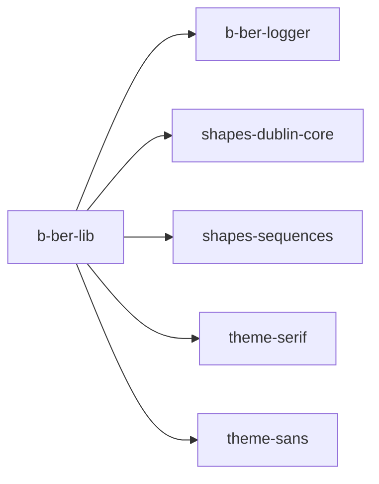

# b-ber-lib

Shared utility library used across all build pipeline packages. Provides the
`State` singleton (the shared mutable build state), configuration loading,
YAML/HTML helpers, and the EPUB spine/manifest data model.

**Last updated:** 2026-06-19

## Dependency graph

See [02-package-dependencies.md](../02-package-dependencies.md) for the full
monorepo dependency map.

## Tooling

| Concern | Value |
| ------- | ----- |
| Node target | `>= 10.x` (root engine range; EOL April 2021) |
| Source language | JavaScript (`.js`) |
| Transpiler | Babel 7 — `@babel/preset-env`, target: Node 16 (prod) / current (test) |
| Build output | Transpiled in-place to package root (not a `dist/` subdirectory) |
| Main entry | `index.js` (after transpilation: same directory as `src/`) |
| Test runner | Jest `^26.6.3` |
| Test transform | `./jest-transform-upward.js` (a custom shim that delegates to the root `babel.config.js`) |
| Bundler | none |
| TypeScript | no |

**Note on build output:** Unlike most packages that emit to `dist/`, `b-ber-lib`
transpiles in-place: `src/State.js` becomes `./State.js` at the package root.
The `clean` script removes all root-level `.js` files before each build.
This is an unusual pattern — it means the package root is polluted with build
artefacts, which `git` must ignore. It is a migration friction point for TASK-008.

## External dependencies

| Package | Version | Status | Notes |
| ------- | ------- | ------ | ----- |
| `fs-extra` | `^8.1.0` | STALE | v8 predates promise-first API (v10+). Most of its API is now in `fs.promises`. |
| `glob` | `^7.1.4` | STALE | v7 is callback-based; v10+ is promise-native and ships a `glob.sync`. |
| `htmlparser2` | `^3.9.2` | STALE | v9.x is current; v3 is 6 major versions behind. |
| `js-yaml` | `^3.12.0` | STALE | v4 removes `safeLoad` in favour of `load`; requires a code migration. |
| `lodash` | `^4.17.21` | OK | Monolithic import is fine; replace individual method package imports elsewhere. |
| `mime-types` | `^2.1.24` | OK | Stable; API unchanged. |
| `tar` | `^6.1.11` | OK | — |
| `vinyl` | `^2.2.0` | OK | — |
| `yargs` | `^13.3.0` | STALE | v17.x is current; v13 is 4 major versions behind. |
| `yawn-yaml` | `1.5.0` | STALE (pinned) | Pinned exactly; no caret — fragile. Unmaintained. |
| `mock-fs` | `^4.4.2` | STALE / INCOMPATIBLE | v4 breaks on Node 22+ (uses removed internal binding API). Replace with real temp dirs. See MEMORY: mock-fs Node 24 incompatibility. |
| `layouts` | `^3.0.2` | STALE | Unmaintained; last release in 2019. |

## Known issues / open tasks

- `testURL` in `jest.config.js` is a Jest 26 option removed in Jest 27+ —
  blocks Jest upgrade (see TASK-008).
- The in-place transpilation pattern (no `dist/`) is unusual and makes
  TypeScript migration harder (TASK-008): the TS compiler output directory
  would need to match the current flattened layout.
- `mock-fs ^4.4.2` in tests is incompatible with Node 22+ (fails on Node 24).
- `yawn-yaml` is pinned without a range (`1.5.0`) — it will not receive
  patch updates. The package is also unmaintained.
- `js-yaml ^3` uses the deprecated `safeLoad` API; upgrade to v4 requires
  changing all call sites from `yaml.safeLoad(str)` to `yaml.load(str)`.

## See also

- [Tooling matrix](../06-tooling-matrix.md) — monorepo-wide tooling comparison
- [External dependencies](../07-external-dependencies.md) — full staleness audit
- [Package dependency graph](../02-package-dependencies.md) — full dep map
- [Diagram index](../README.md)
