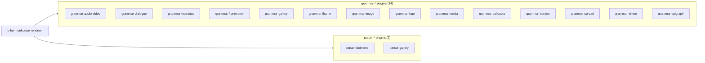

# b-ber-markdown-renderer

The rendering pipeline's core package. Creates a `markdown-it` instance,
registers all grammar and parser packages as plugins, and exposes a `render()`
function that transforms extended Markdown source into EPUB-compatible XHTML.

**Last updated:** 2026-06-19

## Dependency graph



See [04-markdown-rendering-layer.md](../04-markdown-rendering-layer.md) for
the full grammar/parser composition diagram and directive syntax details.

## Tooling

| Concern | Value |
| ------- | ----- |
| Node target | `>= 10.x` (root engine range; EOL April 2021) |
| Source language | JavaScript (`.js`) |
| Transpiler | Babel 7 — `@babel/preset-env`, target: Node 16 (prod) / current (test) |
| Build output | `dist/` via `babel -d dist/ src/` |
| Main entry | `dist/index.js` |
| Test runner | Jest `^26.6.3` |
| Test transform | `./jest-transform-upward.js` (delegates to root `babel.config.js`) |
| Bundler | none |
| TypeScript | no |

## Source structure

```
src/
  index.js          — exports render() and the markdown-it instance
  highlightjs/      — syntax highlighting integration (bundled separately)
```

## External dependencies

| Package | Version | Status | Notes |
| ------- | ------- | ------ | ----- |
| `markdown-it` | `^8.4.1` | STALE | v14.x is current; v8 is 6 major versions behind. The API between v8 and v14 has significant changes in plugin registration and token handling. |
| `markdown-it-front-matter` | `^0.1.2` | STALE | Very old; pin is effectively exact. Check compatibility with any `markdown-it` upgrade. |
| `lodash` | `^4.17.21` | OK | — |

## Known issues / open tasks

- **`markdown-it ^8.4.1` is 6 major versions stale.** All 14 grammar packages
  and 2 parser packages register as `markdown-it` plugins using v8's API.
  Upgrading to v14 would require auditing every plugin's `rule` registration
  and token access patterns. This is a large coordinated change — it cannot
  be done in isolation.
- `testURL` in jest config is a Jest 26 option removed in Jest 27+ — blocks
  Jest upgrade (TASK-008).
- `markdown-it-front-matter ^0.1.2` is old and its compatibility with a
  future `markdown-it` upgrade is unknown.

## See also

- [Markdown rendering layer](../04-markdown-rendering-layer.md) — full grammar/parser composition
- [Build pipeline](../03-build-pipeline.md) — where rendering fits in the step sequence
- [Tooling matrix](../06-tooling-matrix.md) — monorepo-wide tooling comparison
- [External dependencies](../07-external-dependencies.md) — full staleness audit
- [Package dependency graph](../02-package-dependencies.md) — full dep map
- [Diagram index](../README.md)
