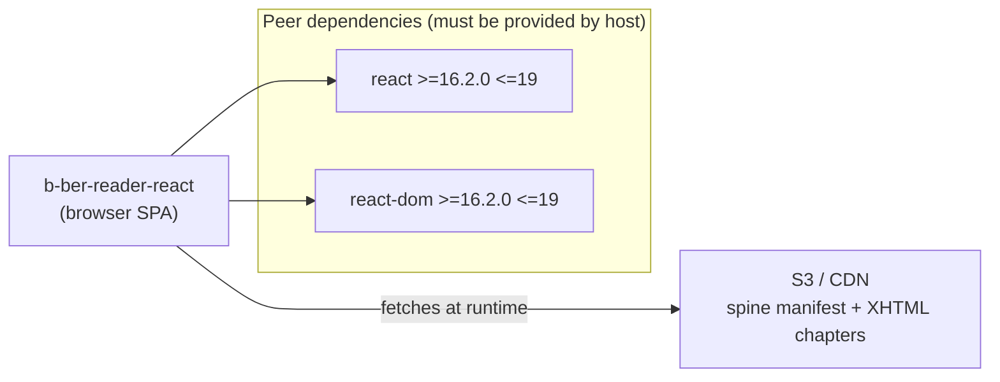

# b-ber-reader-react

Browser-based EPUB reader. Fetches a spine manifest from S3/CDN, renders
chapter XHTML files as a paginated single-page application, and handles
chapter navigation, font size / theme controls, and media embeds.

This package has **no internal (`@canopycanopycanopy/*`) dependencies** —
it is a standalone React application that consumes the build output of the
b-ber pipeline, not the pipeline itself.

**Last updated:** 2026-06-19

## Dependency graph



No internal monorepo deps. See [05-reader-react.md](../05-reader-react.md)
for the full component tree and Redux action flow.

## Tooling

| Concern | Value |
| ------- | ----- |
| Node target | `>= 10.x` (root engine range; EOL April 2021) |
| Source language | JavaScript + JSX (`.js`, `.jsx`) |
| Transpiler | Babel 7 — `@babel/preset-env` (browser targets: last 2 versions, > 2%) + `@babel/preset-react` |
| Build output | webpack bundle in `dist/` |
| Main entry | `dist/index.js` |
| Test runner | Jest `^26.6.3` |
| Test transform | `babel-jest ^24.8.0` (via root `babel.config.js`) |
| Bundler | webpack `^5.74.0` + webpack-cli `^4.10.0` |
| Dev server | webpack-dev-server `^4.11.1` |
| CSS | SCSS via `sass ^1.49.8` + `sass-loader ^13.0.2` |
| TypeScript | no |
| Linting | ESLint `^7.32.0` (targeted for removal — see TASK-015) |

## Source structure

```
src/
  index.jsx         — application entry point (ReactDOM.render / createRoot)
  index.scss        — root SCSS file
  config.js         — environment configuration
  actions/          — Redux action creators
  components/       — React components
    App.jsx         — routing + store provider
    Controls.jsx    — font-size / theme / fullscreen toggles
    Frame.jsx       — chapter XHTML renderer
    Layout.jsx      — flex container; sets viewport dimensions
    Navigation/     — TOC sidebar + prev/next controls
    Reader/         — main reader container
    Sidebar/        — sidebar wrapper
    Spinner.jsx     — loading indicator
    Spread.jsx      — full-bleed spread image layout
    ...
  constants/        — action type constants
  fonts/            — bundled font files
  helpers/          — utility functions
  hooks/            — React hooks
  lib/              — XMLAdaptor, Viewport helpers
  models/           — data model helpers
  reducers/         — Redux reducers
    reader-location.js   — current spine position
    reader-settings.js   — font size, theme
    user-interface.js    — sidebar, controls state
    viewer-settings.js   — viewer configuration
    view.js              — combined view state
    markers.js           — pagination marker state
  styles/           — component-level SCSS partials
```

## External dependencies

| Package | Version | Status | Notes |
| ------- | ------- | ------ | ----- |
| `react` | `>=16.2.0 <=19` (peer) | OK | Root provides `^19`. |
| `react-dom` | `>=16.2.0 <=19` (peer) | OK | Root provides `^19`. |
| `redux` | `^5.0.0` | OK | — |
| `react-redux` | `^9.2.0` | OK | — |
| `redux-thunk` | `^3.1.0` | OK | Middleware for async actions. |
| `react-player` | `^2.10.1` | OK | Media embed player. |
| `html-to-react` | `^1.4.3` | STALE | Used to parse/render XHTML chapter content as React. |
| `react-attr-converter` | `^0.3.1` | OK | Converts HTML attributes to React prop names. |
| `classnames` | `^2.2.5` | OK | — |
| `detect-browser` | `^2.1.0` | STALE | v5.x is current. Used for browser-specific workarounds. |
| `history` | `^4.7.2` | STALE | v4 is React Router 5 era; v5 is the current API. |
| `prop-types` | `^15.6.1` | OK (but see note) | React 19 deprecated runtime prop-type validation. |
| `resize-observer-polyfill` | `^1.5.0` | DEPRECATED | ResizeObserver is native in all supported browsers. Remove. |
| `object-fit-images` | `^3.2.3` | OK (but see note) | `object-fit` polyfill; no longer needed in modern browsers. |
| `url-search-params-polyfill` | `^4.0.0` | DEPRECATED | `URLSearchParams` is native in all modern browsers and Node >= 10. Remove. |
| `setimmediate` | `^1.0.5` | DEPRECATED | `setImmediate` is not a web standard; the polyfill is a webpack 5 shim. May be removable. |
| `webpack` | `^5.74.0` | OK | Current; targeted for Vite migration in TASK-006. |
| `webpack-cli` | `^4.10.0` | STALE | v5 aligns with webpack 5.x. |
| `webpack-dev-server` | `^4.11.1` | STALE | v5 is current. |
| `webpack-cleanup-plugin` | `^0.5.1` | DEPRECATED | Unmaintained; webpack 5 `output.clean` is the built-in replacement. |
| `webpack-remove-empty-scripts` | `^1.0.1` | OK | — |
| `webpack-bundle-analyzer` | `^4.6.1` | OK | — |
| `sass` | `^1.49.8` | STALE | Current is 1.88.x. |
| `sass-loader` | `^13.0.2` | STALE | 16.x is current. |
| `css-loader` | `^0.28.10` | STALE | v7.x is current; v0.28 is ancient. |
| `style-loader` | `^0.20.2` | STALE | v4 is current. |
| `postcss` | `^7.0.14` | STALE | v8 is current; breaking change for plugins. |
| `postcss-cssnext` | `^3.1.0` | DEPRECATED | Abandoned; replace with `postcss-preset-env`. |
| `file-loader` | `^6.2.0` | DEPRECATED | Replaced by webpack 5 built-in asset modules. |
| `url-loader` | `^4.1.1` | DEPRECATED | Same as `file-loader`. |
| `xml-js` | `^1.6.2` | OK | XHTML parsing utility. |
| `xmlhttprequest-ssl` | `^2.0.0` | STALE | Legacy XHR polyfill; `fetch` should be used instead. |

## Known issues / open tasks

- **TASK-006 (Vite migration):** webpack is the current bundler but is targeted
  for replacement with Vite. The CSS pipeline (css-loader, style-loader,
  postcss-cssnext, file-loader, url-loader) will be simplified significantly.
- **TASK-015 (Biome):** ESLint and Prettier are being replaced by Biome.
- **React 19 migration (TASK-094–100):** class components are being converted
  to functional components with hooks. See `MIGRATION-CONVENTIONS.md` for the
  per-commit verification gate.
- `testURL` in jest config is a Jest 26 option removed in Jest 27+ — blocks
  Jest upgrade (TASK-008).
- Multiple deprecated webpack loaders are in use (`file-loader`, `url-loader`,
  `css-loader ^0.28`, `style-loader ^0.20`) — these need replacing before
  any webpack 6 upgrade.
- `history ^4.7.2` is tied to React Router v5 semantics; upgrading to v5
  is a breaking change.
- `redux-mock-store ^1.5.4` (test dep) is unmaintained; migrate to
  `@reduxjs/toolkit`'s `configureStore` in tests.

## See also

- [Reader React architecture](../05-reader-react.md) — component tree, Redux flow, pagination engine
- [Tooling matrix](../06-tooling-matrix.md) — monorepo-wide tooling comparison
- [External dependencies](../07-external-dependencies.md) — full staleness audit
- [Package dependency graph](../02-package-dependencies.md) — full dep map
- [Diagram index](../README.md)
