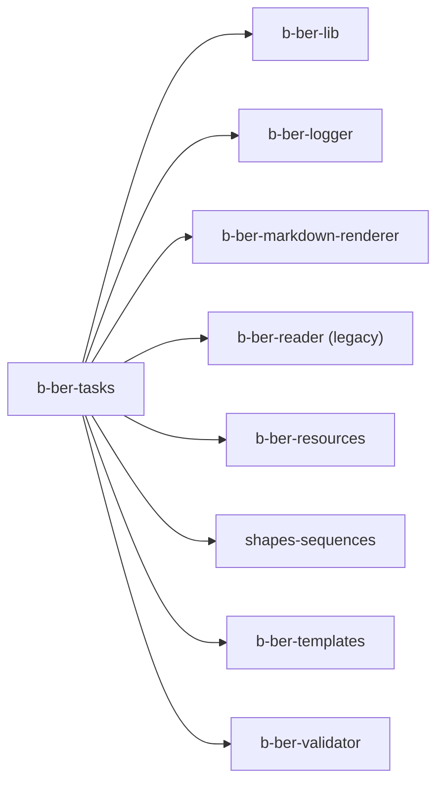

# b-ber-tasks

Ordered build task definitions. Each task corresponds to one build step
(clean, container, cover, sass, render, opf, epub, pdf, ...). `b-ber-tasks`
exports the complete task graph; `b-ber-cli` selects and runs the appropriate
subset for a given output format.

**Last updated:** 2026-06-19

## Dependency graph



See [02-package-dependencies.md](../02-package-dependencies.md) for the full
monorepo dependency map; see [03-build-pipeline.md](../03-build-pipeline.md)
for the step ordering.

## Tooling

| Concern | Value |
| ------- | ----- |
| Node target | `>= 10.x` (root engine range; EOL April 2021) |
| Source language | JavaScript (`.js`) |
| Transpiler | Babel 7 — `@babel/preset-env`, target: Node 16 (prod) / current (test) |
| Build output | `dist/` via `babel -d dist/ src/` |
| Main entry | `dist/index.js` |
| Test runner | Jest `^26.6.3` |
| Test transform | `./jest-transform-upward.js` (delegates to root `babel.config.js`) |
| Bundler | none |
| TypeScript | no |

## Source structure

```
src/
  index.js          — task registry / export map
  clean/            — clears dist/ directories
  container/        — creates EPUB directory structure
  copy/             — copies static assets + fonts
  cover/            — generates cover image (pureimage)
  deploy/           — uploads to S3 / CDN
  epub/             — runs epub-zipper
  footnotes/        — collects footnote state, writes notes.xhtml
  generate/         — scaffolding helper (bber new)
  init/             — project initialisation
  inject/           — patches XHTML with nav/ncx refs
  loi/              — list of illustrations (figure index)
  mobi/             — CSS patching + Calibre ebook-convert wrapper
  opf/              — writes OPF manifest + NCX spine (via b-ber-templates)
  pdf/              — wkhtmltopdf wrapper
  reader/           — builds legacy b-ber-reader bundle
  render/           — Markdown → XHTML (via b-ber-markdown-renderer)
  sample/           — slices a preview EPUB
  sass/             — compiles SCSS to CSS
  scripts/          — copies JavaScript assets
```

## External dependencies

| Package | Version | Status | Notes |
| ------- | ------- | ------ | ----- |
| `fs-extra` | `^8.1.0` | STALE | v8 predates promise-first API. |
| `glob` | `^7.1.4` | STALE | v7 is callback-based. |
| `image-size` | `^0.8.3` | STALE | v1.x is current; different import API. |
| `lodash` | `^4.17.21` | OK | — |
| `lunr` | `^2.1.6` | OK | Full-text search index used in web build. |
| `mime-types` | `^2.1.24` | OK | — |
| `pureimage` | `^0.1.6` | STALE | v0.4.x is current. Used to generate cover images. |
| `sass` | `^1.49.8` | STALE | Current is 1.x (minor); latest is 1.88.x. |
| `cheerio` | `^1.0.0-rc.2` | STALE | RC was finalised as 1.0.0 in 2022; use `^1.0.0`. |
| `epub-zipper` | `^1.4.0` | OK | — |
| `mock-fs` | `^4.4.2` | INCOMPATIBLE | v4 breaks on Node 22+. Replace with real temp dirs in tests. |
| `browser-sync` | `^2.27.7` | STALE | 3.x is current. Used in dev server. |

## Known issues / open tasks

- `testURL` in `jest.config.js` is a Jest 26 option removed in Jest 27+ —
  blocks Jest upgrade (see TASK-008).
- `mock-fs ^4.4.2` in tests is incompatible with Node 22+.
- `image-size ^0.8.3` uses the older callback API; v1.x is async-by-default.
- `pureimage ^0.1.6` is a very old version; the cover generation code may
  need updating when the package is upgraded.
- `cheerio ^1.0.0-rc.2` was pinned before the official 1.0.0 release.

## See also

- [Build pipeline](../03-build-pipeline.md) — step ordering and State flow
- [Tooling matrix](../06-tooling-matrix.md) — monorepo-wide tooling comparison
- [External dependencies](../07-external-dependencies.md) — full staleness audit
- [Package dependency graph](../02-package-dependencies.md) — full dep map
- [Diagram index](../README.md)
