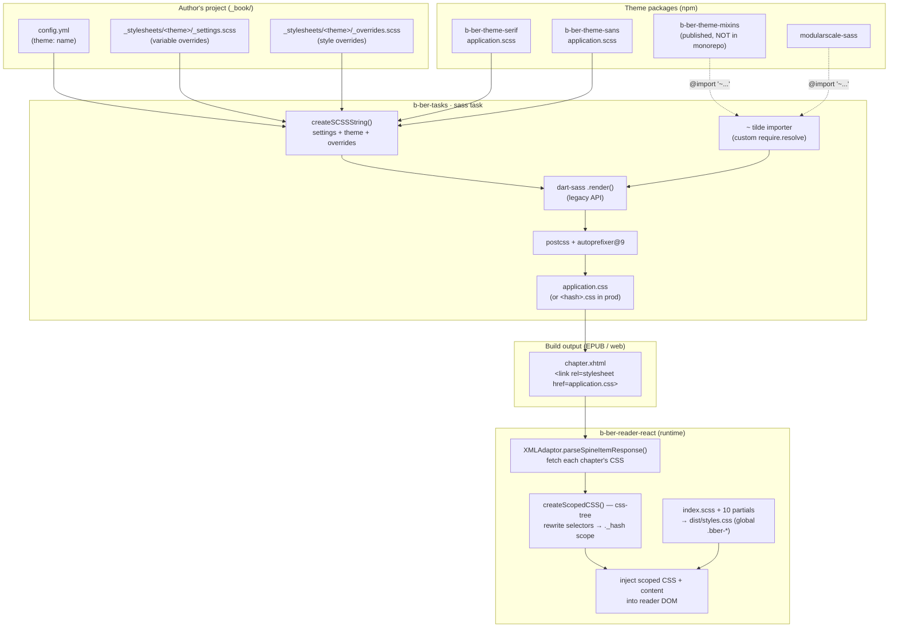

# TASK-076 — Findings: Styling architecture audit

**Type:** Research / audit (no code changes)
**Feature:** React 19 (reader-react) — but scope widened to the whole styling pipeline
**Companion task:** `tasks/TASK-076.open.md`
**Date:** 2026-06-18
**Branch:** `feat/upgrades` (research/docs)

This expands TASK-076's first subtask ("Audit current SCSS structure") into a
monorepo-wide audit of how styles are authored, compiled, shipped, and applied —
covering the reader, individual projects, and themes — and gives recommendations
for moving the reader off SCSS, simplifying the build/dep graph, and choosing
alternatives to SCSS for themes.

---

## TL;DR

There are **three independent styling subsystems** that are easy to conflate but
have almost nothing in common except the word "SCSS":

| # | Subsystem | Authored as | Compiled by | Applied to the DOM by | Scoped? |
|---|-----------|-------------|-------------|------------------------|---------|
| **A** | **Reader chrome** (reader-react's own UI: controls, spinner, footnotes, layout) | `src/index.scss` + 10 partials | **Vite** (`sass` dep, dev + lib build) → `dist/styles.css` | Bundled `import './index.scss'` in `src/index.tsx` | **No** — global class names (`.bber-*`) |
| **B** | **Book/project content** (the author's chapters) | Project `_stylesheets/` SCSS + a theme | **`b-ber-tasks` sass task** (legacy dart-sass `render` API) → `application.css` | Reader fetches each chapter's `<link rel=stylesheet>` at runtime and **rewrites every selector** (css-tree) before injecting | **Yes** — runtime, by hashed class |
| **C** | **Themes** (the design system books build on) | `b-ber-theme-serif` / `b-ber-theme-sans` SCSS + published `b-ber-theme-mixins` | Same as B (themes are an input to B) | Same as B | Same as B |

Key takeaways:

1. **The reader's own SCSS (A) is tiny and trivial to migrate** — ~10 short
   partials, only two real mixins (`transition`, `break-at`) and a flat set of
   variables. This is what TASK-076 targets, and it is low-risk.
2. **Project/theme SCSS (B + C) is a public authoring API we can't remove**, but
   the *machinery* around it is dated: the sass task uses dart-sass's **legacy
   `render` API**, a **hand-rolled `~` (tilde) importer** that re-implements
   webpack's node_modules resolution, and **`@import`** everywhere (deprecated,
   removed in Dart Sass 3.0). That machinery — not SCSS-the-language — is the
   real cost.
3. The reader does **not** rely on SCSS to isolate book content; isolation is a
   **runtime css-tree selector-rewrite** (subsystem B). So migrating the reader's
   chrome to CSS Modules does **not** touch the style-bleed-prevention path.
4. **Two shipped debug-only rules leak into production** (see Risks): a viewport
   label in the reader and a `.foo` rule in every theme.

---

## System map



---

## 1. How the reader's own styles load (subsystem A)

- Entry: `src/index.tsx` does three style imports at module top:
  ```ts
  import './lib/polyfills'
  import 'material-icons/iconfont/filled.css'   // icon font, from node_modules
  import './index.scss'                          // the reader chrome
  ```
- `src/index.scss` `@import`s 10 partials in `src/styles/` then adds two inline
  blocks (`.bber-spread`, and a `body::before` viewport label — see Risks).
- Partials are **cleanly layered**: `_variables` (flat vars) → `_mixins` (two
  mixins; already uses `@use 'sass:list'`/`'sass:map'`) → the rest
  (`_fonts`, `_icons`, `_controls`, `_spinner`, `_print`, `_media`, `_footnote`,
  `_layout`). All component styles use **global** `.bber-*` class names.
- **Compilation**: there is no PostCSS/sass config file — **Vite owns it**. The
  `sass` dependency lets Vite compile `.scss` on the fly for both `npm start`
  (`vite.config.js`) and the library build (`vite.config.lib.js`). The lib build
  emits a single asset renamed to `dist/styles.css` via `assetFileNames`.
- **How consumers get it**: two paths exist.
  - `package.json` `exports` advertises `"./dist/styles.css"` (the built CSS) for
    standalone consumers.
  - `b-ber-reader` (the host app) **ignores the dist** and aliases reader-react
    **to source**, so the SCSS is recompiled in the host's own Vite pass (see
    `packages/b-ber-reader/vite.config.js`, comment: *"Styles come from
    b-ber-reader-react's source… no separate dist CSS"*).

**The dev-server deprecation warnings** flagged in TASK-076 come from this
subsystem's use of `@import` (Dart Sass legacy). They are self-inflicted (our own
partials), not third-party.

## 2. Can the reader's styles be overridden?

**Not in any first-class way today.**

- Styles are global `.bber-*` classes injected via a bundled `import`. A host
  app can override them only by shipping **later, higher-specificity CSS** for
  the same selectors — fragile and undocumented.
- There is **no CSS-custom-property surface** for theming the reader (colors,
  spacing, fonts are hard-coded in `_variables.scss` as Sass vars, which vanish
  at compile time).
- When consumed from source (the b-ber-reader path), the reader's CSS and the
  host's CSS share one global cascade, so collisions are possible in both
  directions. This is precisely the bleed risk TASK-076 names — but note it
  applies to the **reader chrome vs. host**, *not* to book content (§3).

> **Implication for migration:** moving to CSS Modules fixes outbound bleed
> (reader → host) by hashing class names. If we also want hosts to *intentionally*
> re-skin the reader, that's a separate feature: expose a small set of CSS custom
> properties (`--bber-fg`, `--bber-control-bg`, …) on the reader root. Worth
> adding in the same pass since custom properties are the natural override API.

## 3. How project (book) styles are loaded and scoped by the reader (subsystem B)

This is the part the user described as *"we pull in the css and scope it manually
so styles don't leak"* — confirmed, and it's the load-bearing isolation
mechanism.

```mermaid
sequenceDiagram
    participant R as Reader (XMLAdaptor)
    participant X as chapter.xhtml
    participant N as Network
    participant T as css-tree
    participant D as Reader DOM

    R->>X: parse spine item (xml-js / DOMParser)
    R->>X: collect &lt;link rel=stylesheet&gt; + inline &lt;style&gt;
    R->>N: Request.getText(each stylesheet URL)
    N-->>R: raw CSS
    R->>T: createScopedCSS(sheets, "_<hash>", opsURL)
    Note over T: walk every selector —<br/>prepend "._hash " scope;<br/>html→.hash, body→#content;<br/>rewrite relative url() to absolute
    T-->>R: scopedCSS string
    R->>D: inject scoped CSS + parsed React content
```

- `helpers/XMLAdaptor.ts` → `parseSpineItemResponse()` extracts `<link
  rel=stylesheet>` hrefs and inline `<style>` from each chapter, fetches the
  linked CSS over the network, and passes everything to `createScopedCSS()`.
- `createScopedCSS()` parses each sheet with **css-tree** and **rewrites every
  selector** to be prefixed with a per-book hashed class (`._<hash>`).
  `html` → the scope class, `body` → `#content`, and relative `url()`s are
  resolved to absolute. This is what keeps one book's `application.css` from
  styling the reader chrome or another book.
- Separately, `lib/DocumentPreProcessor.ts` + `models/MediaStyleSheet.ts` inject
  the reader's **layout-mode** stylesheets (column/scroll/slide via
  `lib/multi-column-styles.ts`) as `<style media=…>` elements it can swap at
  runtime. This is reader-generated CSS-in-JS-as-strings, independent of SCSS.

**So book content isolation has nothing to do with SCSS or CSS Modules.** It's a
runtime css-tree transform. TASK-076 won't change it (and shouldn't).

## 4. How SCSS/CSS is managed in individual projects + themes (subsystems B & C)

This is the **public authoring API** for book designers. It cannot be removed.

The compile entry is `b-ber-tasks/src/sass/index.ts` (`sass` task). It:

1. **`createSCSSString()`** concatenates up to three buffers, in order:
   - `_stylesheets/<theme>/_settings.scss` — **user variable overrides** (prepended)
   - the theme's `application.scss` (`state.theme.entry`) — **theme body**
   - `_stylesheets/<theme>/_overrides.scss` — **user style overrides** (appended)

   It also injects `$build: "<epub|mobi|web|…>"` as a variable so SCSS can branch
   on output target. Theme is chosen by `config.theme` (resolved in
   `b-ber-lib/State.ts`; falls back to `b-ber-theme-serif`).
2. **`renderCSS()`** calls dart-sass's **legacy `render()`** (callback API) with:
   - a custom **`importer`** implementing the `~` tilde convention (§5),
   - `includePaths` (project `_stylesheets/`, theme dir, theme parent),
   - `outputStyle` compressed in prod.
3. **`applyPostProcessing()`** runs PostCSS + **autoprefixer@9**.
4. **`writeCSSFile()`** writes `application.css` (dev) or `<hash>.css` (prod) to
   the build's stylesheets dir.

The theme itself (`b-ber-theme-serif/application.scss`) is classic SCSS:
`@namespace` rules, `@import '~modularscale-sass/...'`, `@import
'~@canopycanopycanopy/b-ber-theme-mixins/application'`, `@import 'settings'`,
`@import 'typography'`, `@import 'layout'`, plus `$build`-conditional logic and
modular-scale math. `b-ber-theme-sans` additionally `@import`s serif's
`typography`/`layout` via tilde. **`b-ber-theme-mixins` is published to npm and
is NOT in this monorepo** — it's resolved from `node_modules`.

The compiled `application.css` is linked into every chapter via the
`b-ber-templates` Xhtml `stylesheet()` template
(`<link rel="stylesheet" href="">`), which is exactly what the reader
later fetches and scopes (§3).

## 5. The tilde (`~`) loader "weirdness"

Confirmed and isolated to the project/theme sass task.

- SCSS files use webpack's old convention `@import '~pkg/file'` to mean "resolve
  `pkg` from node_modules." Dart Sass has **no built-in `~` support** — so
  `b-ber-tasks/src/sass/index.ts` ships a hand-rolled `resolveImportedModule()`
  that strips the `~`, splits the path, handles `@scope/name`, and uses
  `require.resolve(..., { paths: [themeDir] })` to find the package, then
  reattaches the sub-path. It's wired in as the dart-sass `importer` callback.
- This exists **only** because the SCSS uses the `~` syntax. It re-implements
  node resolution by hand and is tied to the **legacy `render` importer API**,
  which Dart Sass deprecates in favor of the modern `importers` array +
  `compileString`/`compileAsync`, and a `loadPaths` option.

> Modern Dart Sass has two clean replacements: (a) drop `~` and use **`@use`
> with `loadPaths: [node_modules]`**, or (b) the official **`pkg:` importer**
> (`@use 'pkg:modularscale-sass'`). Either deletes `resolveImportedModule()`
> entirely.

---

## Risks & defects surfaced during the audit

1. **Debug viewport label ships in production.** `src/index.scss` ends with a
   `body::before` block that renders the current breakpoint name
   (`'mobile'`/`'tablet'`/`'desktop-md'`…) as fixed-position text. This is in the
   shipped `dist/styles.css`. It only shows because `content` is set per
   breakpoint — remove or guard behind a dev flag. *(Low effort, do during the
   migration.)*
2. **`.foo` test rule ships in every book.** `b-ber-theme-serif/application.scss`
   contains `.foo { font-size: $font-size-base; }` — a leftover that compiles
   into every project's `application.css`. Same in the sans chain via import.
3. **Stale CSS toolchain devDeps in reader-react.** `postcss@7`,
   `postcss-cssnext` (deprecated), `postcss-import@11`, `autoprefixer@9`,
   `cssnano@4` are still in `b-ber-reader-react/devDependencies` but **Vite owns
   CSS now** (PostCSS 8 / esbuild). These are dead weight and pin old majors —
   remove them. (`autoprefixer@9` is still *live* in the b-ber-tasks sass task —
   that one is a separate upgrade.)
4. **`@import` deprecation warnings** in both the reader partials and the theme
   SCSS — removed in Dart Sass 3.0. Migrating to `@use`/`@forward` clears them.
5. **Possibly-stale alias in `b-ber-reader/vite.config.js`** — it aliases
   reader-react to `../b-ber-reader-react/src/index.jsx`, but the entry is now
   `src/index.tsx` (no `index.jsx` exists). Not a styling issue, but it sits on
   the same source-bundling path that pulls in the reader's SCSS — **verify the
   host actually builds.** Flag for a separate fix, not this task.

---

## Recommendations

### A. Moving the reader off SCSS (TASK-076 core)

**Recommended: CSS Modules in plain `*.module.css` + one global `global.css`,
drop SCSS from the reader entirely.** Rationale:

- The reader's SCSS surface is tiny. The only non-trivial SCSS features in use:
  - `transition(...)` mixin → a 2-line helper; inline the few call sites or a
    single utility class. Trivial.
  - `break-at('<bp>')` mixin (media queries) → replace with **PostCSS
    `@custom-media`** (one shared `@custom-media --desktop-md (...)` file) or
    plain `@media` per module. Vite supports custom-media via its PostCSS or
    Lightning CSS pipeline.
  - `$variables` (colors/spacing) → promote to **CSS custom properties** in
    `global.css`. This doubles as the reader's new **override API** (§2).
  - `sass:list/map` usage in `_mixins` disappears with the mixins.
- Vite handles `*.module.css` natively — no loader config, no `sass` dep.
- **Preserve readable test selectors.** Tests query `.bber-controls__footer`
  etc. Set `css.modules.generateScopedName` to keep readable names in
  dev/test, or migrate those assertions to `data-testid` in the same pass
  (cleaner long-term). Decide before the leaf-component proof-of-concept.

Why not vanilla-extract / Tailwind / styled-components: each adds a dependency
and a paradigm; the user's standing preference is **fewer deps, platform-first**
(`[[feedback-prefer-fewer-deps]]`). CSS Modules is Vite-native and zero-runtime.
Reserve vanilla-extract only if we later want type-safe tokens shared across
packages — not needed for this migration.

**Sequence:** global tokens file first → leaf components (Spinner,
NavigationFooter) as POC → larger components → HOC styles → delete `index.scss`
and the `sass` dev/lib usage → remove dead PostCSS devDeps (Risk 3).

### B. Simplifying the build/dep graph for projects + themes

Keep SCSS as the *authoring language* (it's a public API) but **modernize the
machinery**, which is where the complexity lives:

1. **Replace the legacy `render()` + custom `~` importer** in
   `b-ber-tasks/src/sass/index.ts` with the **modern Dart Sass API**
   (`compileStringAsync` + `importers` / `loadPaths`). Use `loadPaths:
   [node_modules]` or the official `pkg:` importer and **delete
   `resolveImportedModule()`** and all `~` usage in the theme SCSS. (Coordinated
   change: themes + sans's cross-theme imports must drop `~` together.)
2. **Migrate theme `@import` → `@use`/`@forward`.** Removes deprecation warnings
   and makes the variable-override seam explicit (today `_settings.scss` is
   string-prepended — with `@use … with (...)` it becomes a real configured
   module). This is a behavior-sensitive change; verify compiled `application.css`
   is unchanged for a sample book.
3. **Replace `autoprefixer@9` + manual PostCSS** with **Lightning CSS** (already
   in Vite's orbit) or at least bump to autoprefixer 10 + PostCSS 8. Lightning CSS
   does prefixing + minification in one pass and could also subsume `cssnano`.
4. **Pull `b-ber-theme-mixins` into the monorepo** (or document why it stays
   external). It's a hidden first-party dependency resolved from npm; having it
   out-of-tree is why the `~` resolver has to exist at all for mixins.

Net effect: the project/theme path keeps SCSS but loses the custom importer, the
legacy API, the deprecation warnings, and an aging PostCSS stack — a much smaller
surface, even though SCSS stays.

### C. New libs / build strategies to consolidate

- **Lightning CSS** (Rust, Vite-integrated): one tool for prefixing, minify,
  custom-media, nesting. Could serve **both** subsystems — the reader's
  `.module.css` and (via a small wrapper) post-process the theme's compiled CSS —
  shrinking the toolchain to `sass` (themes only) + Lightning CSS.
- **PostCSS `@custom-media`** for the reader breakpoints so `break-at` dies
  without inventing a mixin replacement.
- Treat the **runtime css-tree scoper (§3) as the canonical isolation layer** and
  do not duplicate it with build-time scoping. It already does the hard part.

### D. Alternatives to SCSS for themes

Themes are the hardest to move because they use `@function`, `@mixin`, modular-
scale math, and `$build` branching. Options, in recommended order:

1. **Keep SCSS, modernize the toolchain (Recommendation B).** Lowest risk,
   preserves the authoring API book designers already know, removes the genuinely
   painful parts (custom importer, legacy API). **Recommended.**
2. **Hybrid — expose tokens as CSS custom properties, keep SCSS for logic.**
   Emit theme colors/spacing/scale as `:root { --… }` so books (and potentially
   the reader) can override at runtime without recompiling, while keeping SCSS for
   layout math and `$build` logic. Good incremental step; pairs well with the
   reader's new custom-property override surface.
3. **Full pure-CSS port (custom properties + `@property` + `color-mix()` +
   `clamp()`).** Modern CSS can replace much of the math (`clamp()` for modular
   scale, `color-mix()` for tints), but it **cannot cleanly replace `@mixin`
   composition or `$build`-conditional emission**. High effort, real feature loss.
   **Not recommended now** — revisit only if SCSS becomes a maintenance burden.

> **Bottom line for themes:** the problem was never the SCSS language — it's the
> legacy compile path. Fix that (B), optionally add a custom-property token layer
> (D2), and leave the SCSS authoring API in place.

---

## Suggested updates to TASK-076 and follow-ups

- TASK-076's first subtask is satisfied by this document. The audit confirms the
  reader migration is **low-risk and self-contained** (subsystem A only).
- The project/theme modernization (Recommendation B) is split out as
  **[`TASK-109`](./TASK-109.open.md)** under **Upgrade tooling** — modern Dart
  Sass API, drop the `~` importer, `@use`/`@forward`, refreshed PostCSS/Lightning
  CSS. It is orthogonal to the React reader work and does not touch reader-react.
- Fold the two debug-rule leaks (Risks 1–2) and the dead reader devDeps (Risk 3)
  into the relevant tasks — small, do them while touching the files.
- Flag the `b-ber-reader` `index.jsx` alias (Risk 5) for verification separately.
